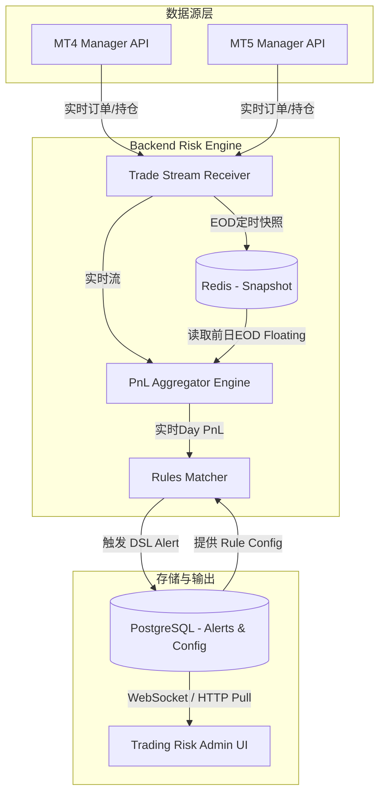
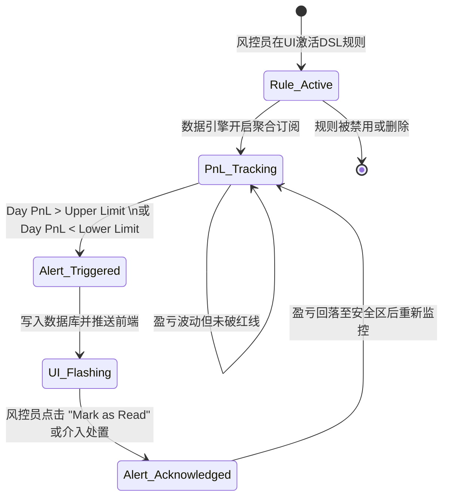

# 架构设计文档 — DSL Limit (Daily Settlement Limit) 日限额报警

基于业务需求（动态聚合跨服务器交易者的日盈亏，并在触达阈值时报警），本架构审查侧重于**数据聚合链路**与**前端展示边界**的最佳工程实践。

---

## 2.1 数据流图



## 2.2 组件边界图

```text
┌─────────────────┐       ws / polling        ┌─────────────────────────┐
│ trading-risk-admin│ ◄─────────────────────────► │ 后端 Risk Engine API      │
│ (前端可视化面板) │  (获取报警列表/推送设置)   │ (Go/Java 聚合中心)        │
└─────────────────┘                           └────────────┬────────────┘
                                                           │ gRPC / SQL
┌─────────────────┐                           ┌────────────▼────────────┐
│ 第三方告警渠道  │ ◄─────────────────────────┤ PostgreSQL + Redis缓存    │
│ (Telegram/邮件) │      (Webhook Push)       │ (规则存储 / EOD 状态快照) │
└─────────────────┘                           └─────────────────────────┘
```

## 2.3 状态机图 (核心实体：Day PnL 告警生命周期)



## 2.4 测试矩阵 (前端 UI 与规则引擎交互)

| 测试场景 | 正常路径 (Expected) | 边界条件 (Boundary) | 异常路径 (Exception) |
|---------|---------|---------|---------|
| **规则增删改** | 成功保存产品标签及正/负限额参数，列表随之更新。 | 仅设置 Max Profit 而忽略 Max Loss，引擎允许单向监控。 | UI 提交非数字字符导致校验拦截 (`NaN`)。 |
| **产品过滤 (Symbols)** | `XAUUSD` 暴雷时仅触发绑定了 `XAUUSD` 标签的报警规则。 | 规则符号列表为空（默认表示监控全盘所有产品）。 | 后端传来的 Symbol 命名与配置不统一导致漏筛。 |
| **告警触发与渲染** | 日盈亏超过配置额度，前端准时弹出 `dsl_limit` 警告卡片，展示当前计算金额。 | 净值刚好等于红线参数（如 PnL === 5000），根据 `>` 还是 `>=` 决定是否报警。 | 缺失 EOD 基础数据导致 `Day PnL` 计算为 `null`，不盲目乱报。 |
| **EOD 隔夜重置** | Server Time 跨越 00:00，当前 Day PnL 重新归零，不再由于昨日遗留亏损持续报警。 | 多服务器处于不同时区（UTC+2 vs UTC+8），EOD 快照的时机选取。 | 数据库死锁导致错过零点快照，次日盈亏基准线错乱。 |

---

## 技术维度审查

### 1. 数据存储方案
*   **前端状态**：页面运行时基于 JavaScript (MockData 引擎模拟)，生产环境将通过 HTTP 请求获取 JSON。
*   **后端持久化 (推荐)**：
    *   **规则表 (PostgreSQL)**：存储 `rules`，字段含 `symbol_filter` (JSONB) 和 `pnl_upper/lower_limit` (Decimal)。
    *   **运行态快照 (Redis)**：存储每日零点的 `Floating PnL (EOD)`，读写极快，用于高频基准对比。

### 2. API 设计 (涉及 UI 交互)
*   `POST /api/v1/rules/dsl`：创建/更新结算限额规则。
    *   Payload 中必须包含双向阈值对象：`{ "pnl_upper_limit": 5000, "pnl_lower_limit": -10000, "symbol_filter": ["XAUUSD"] }`。
*   `GET /api/v1/alerts?type=dsl_limit`：轮询或承接 WS 推送的警报内容。

### 3. 状态管理
*   客户端负责报警的“**UI 确认状态 (Acknowledged)**”和规则的“**表单数据态**”。
*   服务端负责所有“**财务数据的真实状态**”。客户端不允许自行在本地叠加或计算 PnL（避免数据不一致和浏览器崩溃挂起），必须高度依赖后端推送的最终结算值 (`Day PnL`)。

### 4. 失败模式 (Failure Modes)
*   **EOD 数据抓取失败**：如果系统在零点因网络抖动未抓到某一品种的 EOD Floating PnL，次日规则自动降级（挂起针对该品种的监控并通知风控），**绝不可使用 0 替代进行误算报警**。
*   **前端轮询中断**：断网重连后，利用 `last_alert_id` 作为游标，追溯拉取离线期间触发的 DSL 历史报警。

### 5. 信任边界
*   **配置输入不信任**：风控员输入的金额参数必须由 UI 层做第一道验证（屏蔽负值的下限输入混淆），后端落库做第二道强类型校验。
*   **流数据受信**：来自底层 MT4/5 Manager API 的财务流水作为绝对事实来源（SSOT）。

### 6. 性能与扩展
*   **瓶颈预测**：如果公司有 10 万个活跃 Symbol/Account 组合在瞬间爆仓，聚合引擎每秒要计算 10 万次差值。
*   **前端脱敏**：前端不可接收明细的 Tick 流，必须且只接收超过阈值后的**事件包 (Alert Event)**，防止内存溢出。

---

## 明确技术决策清单

*   **[决策 1]：Day PnL 是由前端累计还是后端聚合？**
    *   **推荐**：**后端全权聚合**。
    *   **理由**：浏览器极易刷新丢状态；涉及跨时区时间窗口判定，前端计算会导致各客户端显示不一致。前端只做展示层（Thin Client）。
*   **[决策 2]：对于空符号参数（不筛选 Symbol），如何监控？**
    *   **推荐**：**按单产品维度分别核算，谁超标报谁，而不是算总账**。
    *   **理由**：算总账（把多赚的和亏的全公司合并）会掩盖单一劣质产品的巨大亏损！如果没填 Symbol，则视为“系统循环每一款产品，任何一个独立产品亏损超限即报”。

## 实施任务分解 (立即在前端落地)

由于我们在 `trading-risk-admin` 开发阶段，以下任务可并行启动：
1.  **I18n 覆盖**：新增 DSL Limit 领域专属多语言词汇表 (js/i18n.js)。
2.  **表单建模**：封装包含“多产品下拉标签 (TagInput)”及“日内止盈/止损输入框”的风控规则组件 (js/modules/rules.js)。
3.  **UI沙盘演习**：在 MockData 中强行写入一次破防警报，确保告警卡片能用红/绿特殊字体醒目提示突破阈值金额 (js/mock-data.js)。

此份架构文档已定调，技术边界清晰，当前正处于【架构审查完成，等待开始执行计划】节点。
